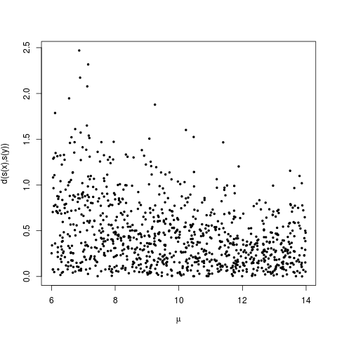
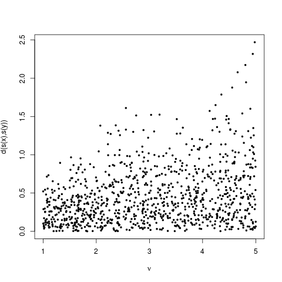
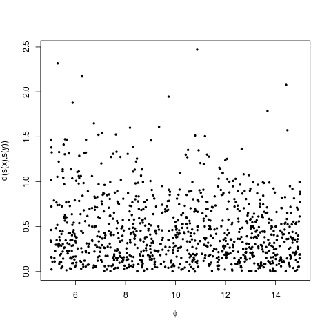
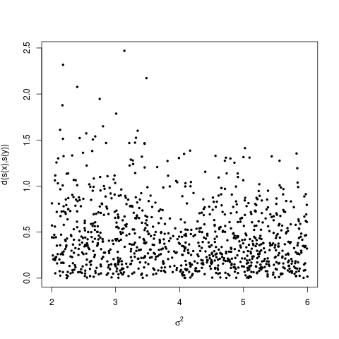
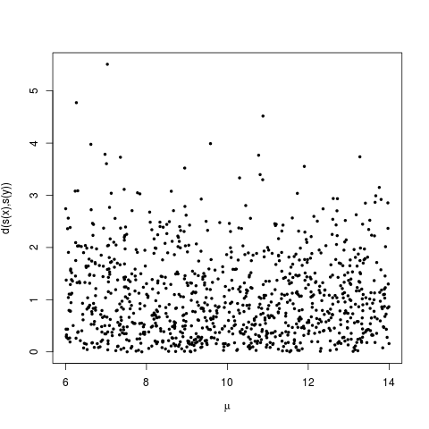
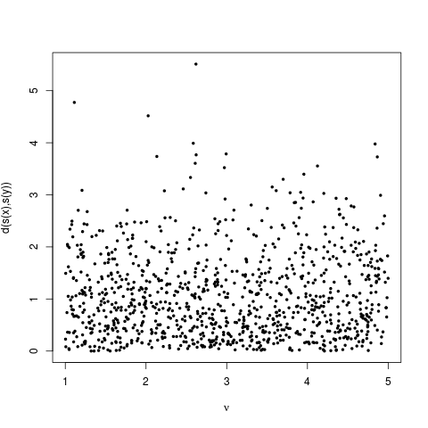
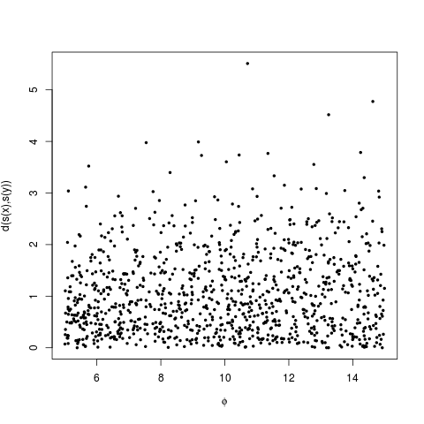
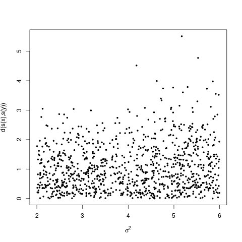

# Status update week 42

Just a recap: For our setup we assume $p(\boldsymbol{x}|\boldsymbol{\theta})$
is a Gaussian field, and the goal is to find estimates for the parameters
controlling the field, which are gathered in $\boldsymbol{\theta}$. 

We go the Bayesian route and say $\boldsymbol{\theta}$ is a random
variable, and the goal then becomes finding the posterior distribution:

\[
p(\boldsymbol{\theta}|\boldsymbol{x})\propto p(\boldsymbol{x}|\boldsymbol{\theta})p(\boldsymbol{\theta})
\]

We can make samples in a reasonable amount of time when it is small.
Do we need to use MCMC to get the actual shape of the posterior with
the prior below? I have not tried calculating it.

Now we say that we are not able to evaluate $p(\boldsymbol{x}|\boldsymbol{\theta})$
as a function of $\boldsymbol{\theta}$, but are able to simulate
from it. This means, given $\boldsymbol{\theta}$ we can produce an
$\boldsymbol{x}$. Are we necessarily sampling from $p(\boldsymbol{x}|\boldsymbol{\theta})$?
Not always from what I gather, since we view it as function from $\boldsymbol{\theta}$
to $\boldsymbol{x}$, but in this setup we are treating it as a probability
distribution and sampling from it.

Since we cannot evaluate $p(\boldsymbol{x}|\boldsymbol{\theta})$,
it means that we cannot use MCMC, but can try ABC which does not require
us to evaluate the likelihood function.

Let $\boldsymbol{y}$ denote the single observation we have in this
setup. If we when sampling from $p(\boldsymbol{x}|\boldsymbol{\theta})$
only accept samples such that $\boldsymbol{y}=\boldsymbol{x}$, then
we are generating a an iid sample from $p(\boldsymbol{\theta}|\boldsymbol{y})$:

\begin{alignat*}{1}
\int_{-\infty}^{\infty} & p(\boldsymbol{\theta})p(\boldsymbol{x}|\boldsymbol{\theta})\mathbb{I}(\boldsymbol{x}=\boldsymbol{y})d\boldsymbol{x}=p(\boldsymbol{\theta})p(\boldsymbol{y}|\boldsymbol{\theta})\propto p(\boldsymbol{\theta}|\boldsymbol{y})
\end{alignat*}

Since we cannot afford to only accept samples where $\boldsymbol{y}=\boldsymbol{x}$,
we will look for statistics, $s(\boldsymbol{y})$, and some distance
function, $d(s(\boldsymbol{y}),s(\boldsymbol{x}))$ such that:

\[
p(\boldsymbol{x}|\boldsymbol{\theta},d(s(\boldsymbol{y}),s(\boldsymbol{x}))<k)\approx p(s(\boldsymbol{y})|\boldsymbol{\theta})
\]

And furthermore the true posterior should be approximated by:

\[
p(\boldsymbol{\theta}|\boldsymbol{y})\approx p(\boldsymbol{\theta}|s(\boldsymbol{y})\propto p(s(\boldsymbol{y})|\boldsymbol{\theta})p(\boldsymbol{\theta})
\]

Is it correct to use the approximation symbol that way in the above?

\subsubsection*{Setup with values}

We have some parameters, and the goal is to find estimates for these.
I just choose some simple priors:

\[
\phi\sim uniform(5,15)
\]

\[
\sigma^{2}\sim uniform(2,6)
\]

\[
\mu\sim uniform(6,14)
\]

\[
\nu\sim uniform(1,5)
\]

\[
\boldsymbol{\theta}=[\phi,\sigma^{2},\mu,\nu]
\]

About the summary statistics: We have been looking at the average.
And I can draw from $p(\boldsymbol{x}|\boldsymbol{\theta},\bar{y}_{obs})$.
I can also say that $s(\boldsymbol{y})=\boldsymbol{y}_{obs}$. In
either case we do not pay much attention to the problem choosing statistics
in this example, which is a big part of ABC. Is it cheating/incorrect
drawing from say $p(\boldsymbol{x}|\boldsymbol{\theta},\boldsymbol{y}_{obs})$,
and not from $p(\boldsymbol{x}|\boldsymbol{\theta})$?

In the analytical calculations we are not treating the parameters
as random variables, so are we comparing the right things? Should
we instead use some setup where we actually know the exact expression
for the posterior? What should the priors be then? We can evaluate
$p(\boldsymbol{x}|\boldsymbol{\theta})$ as a function of $\boldsymbol{\theta}$
since we are saying $p(\boldsymbol{x}|\boldsymbol{\theta})$ is a
Gaussian field, so we could always get at the posterior by MCMC-methods.
The output from the ABC experiment should approximate the posterior.

So I am drawing a sample from $p(\boldsymbol{x}|\boldsymbol{\theta},\boldsymbol{y}_{obs})$
for each sample I am drawing from $p(\boldsymbol{\theta})$, setting
$\boldsymbol{\theta}$ as shown above, and generating some samples,
and I am here including some plots showing the distance between the
average at the observation points.

When looking at articles, it seems the biggest problem is finding
good summary statistics, but here we have so far not looked at that.
Regarding other articles, I am wondering if I should spend quite some
more time on this one:

Constructing summary statistics for approximate Bayesian computation:
semi-automatic approximate Bayesian computation (Paul Fearnhead and
Dennis Prangle). They go into detail about one way to choose statistics.

## Drawing from x given y

Yes, one-dimensional plots are not good in this setting... And I have not checked the calculations, so I do not really trust these plots.

## Drawing from x given y average

