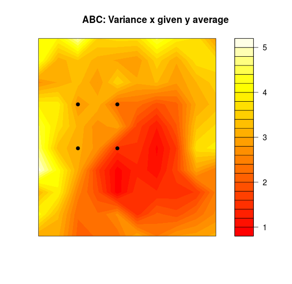

Testing HTML document

\[
\left[\begin{array}{c}
\boldsymbol{Y}\\
\boldsymbol{X}
\end{array}\right]\sim N(\left[\begin{array}{c}
\boldsymbol{\mu}_{\boldsymbol{y}}\\
\boldsymbol{\mu}_{\boldsymbol{x}}
\end{array}\right],\left[\begin{array}{cc}
\boldsymbol{\Sigma}_{\boldsymbol{y}} & \boldsymbol{\Sigma}_{\boldsymbol{y}\boldsymbol{x}}\\
\boldsymbol{\Sigma}_{\boldsymbol{x}\boldsymbol{y}} & \boldsymbol{\Sigma}_{\boldsymbol{x}}
\end{array}\right])
\]

Test image

