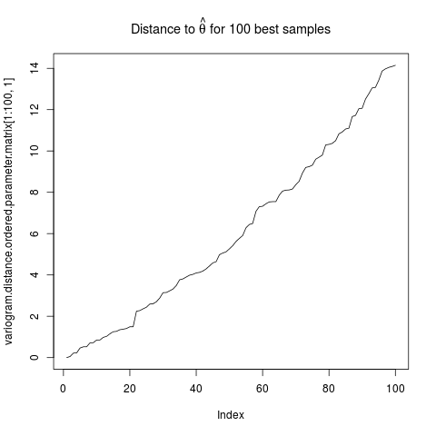

Some plots for discussion:

This is strange.

There are some outliers messing things up. I have not investigated how they arise.

This is also strange I think. Why do the best samples actually lie in a good place (around the green dot). It would make more sense if they were spread around the red dot.

