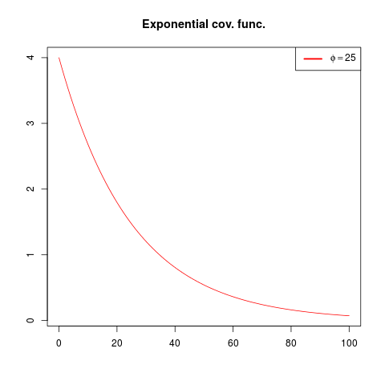

$\mu=10$, the mean of Gaussian field

$\phi=25$, parameter to exponential correlation function

$\sigma^{2}=4$, the variance of the Gaussian field

$\nu=5$, observation noise

The grid is 100 times 100. An exponential correlation function is
used, $\sigma\exp(-\frac{d}{\phi})$, where $d$ is the Euclidean
distance between the points.

