## Derviation of $\boldsymbol{X}|\bar{\boldsymbol{Y}}$

Let $\boldsymbol{X}$ denote the points in a discretized Gaussian
random field:

\[
\boldsymbol{X}\sim N(\boldsymbol{\mu}_{\boldsymbol{x}},\boldsymbol{\Sigma}_{\boldsymbol{x}})
\]

Let $\boldsymbol{Y}$ denote a set of observations:

\[
(\boldsymbol{Y}|\boldsymbol{x})\sim N(\boldsymbol{D}\boldsymbol{x},\nu\boldsymbol{I})
\]

Here we use an exponential covariance function for $\boldsymbol{X}$
in the example: $\sigma^{2}\exp(-\frac{d}{\phi})$, where $d$ is
the Euclidean distance between the points, $\sigma^{2}$ the variance
and $\phi$ a constant. For $\boldsymbol{Y}$ the observations are
independent with variance $\nu$. The $\boldsymbol{D}$ in the above
is a matrix that select the points from $\boldsymbol{x}$ where the
observations are taken.

Then do a linear transformation to get $\bar{Y}|\boldsymbol{X}$

\[
\bar{Y}|\boldsymbol{X}=\boldsymbol{A}\boldsymbol{Y}|\boldsymbol{X}
\]

Where $\boldsymbol{A}$ calculates the average:

\[
\boldsymbol{A}=\left[\begin{array}{cccc}
\frac{1}{n} & \frac{1}{n} & ... & \frac{1}{n}\end{array}\right]
\]

\[
(\bar{Y}|\boldsymbol{X})\sim N(\boldsymbol{ADx},\boldsymbol{A}\nu\boldsymbol{I}\boldsymbol{A}^{T})
\]

First find the full joint distribution of $(\bar{Y},\boldsymbol{X})$:

\[
\left[\begin{array}{c}
\bar{Y}\\
\boldsymbol{X}
\end{array}\right]\sim N(\left[\begin{array}{c}
\mu_{\bar{y}}\\
\boldsymbol{\mu}_{\boldsymbol{x}}
\end{array}\right],\left[\begin{array}{cc}
\boldsymbol{A}\nu\boldsymbol{I}\boldsymbol{A}^{T}+\boldsymbol{AD}\boldsymbol{\Sigma_{x}}\boldsymbol{D}^{T}\boldsymbol{A}^{T} & \boldsymbol{AD}\boldsymbol{\Sigma}_{\boldsymbol{x}}\\
\boldsymbol{\Sigma}_{\boldsymbol{x}}\boldsymbol{D}^{T}\boldsymbol{A}^{T} & \boldsymbol{\Sigma}_{\boldsymbol{x}}
\end{array}\right])
\]

Get the conditional distribution $(\boldsymbol{X}|\bar{Y})$:

\[
(\boldsymbol{X}|\bar{Y})\sim N(\boldsymbol{\mu_{x}}+\boldsymbol{\Sigma}_{\boldsymbol{x}}\boldsymbol{D}^{T}\boldsymbol{A}^{T}(\boldsymbol{A}\nu\boldsymbol{I}\boldsymbol{A}^{T}+\boldsymbol{AD}\boldsymbol{\Sigma_{x}}\boldsymbol{D}^{T}\boldsymbol{A}^{T})^{-1}(\bar{y}-\mu_{\bar{y}}),\boldsymbol{\Sigma_{x}}-\boldsymbol{\Sigma}_{\boldsymbol{x}}\boldsymbol{D}^{T}\boldsymbol{A}^{T}(\boldsymbol{A}\nu\boldsymbol{I}\boldsymbol{A}^{T}+\boldsymbol{AD}\boldsymbol{\Sigma_{x}}\boldsymbol{D}^{T}\boldsymbol{A}^{T})^{-1}\boldsymbol{AD}\boldsymbol{\Sigma}_{\boldsymbol{x}})
\]

## Simple experiment
* $\mu=10$, the mean of Gaussian field
* $\phi=10$, parameter to exponential correlation function
* $\sigma^{2}=4$, the variance of the Gaussian field
* $\nu=2$, observation noise

The grid is 25 times 25.

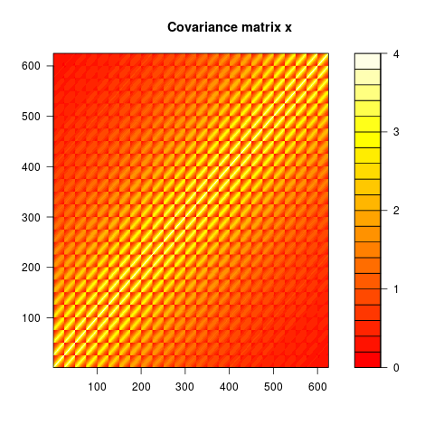
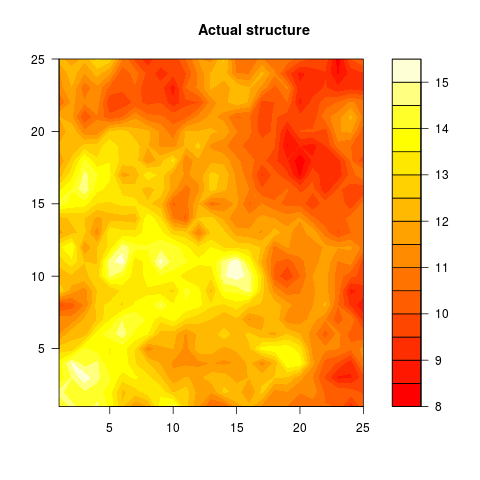
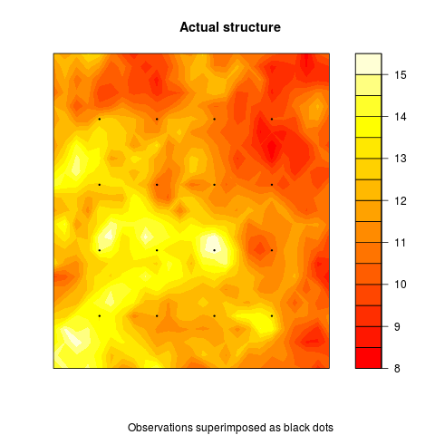
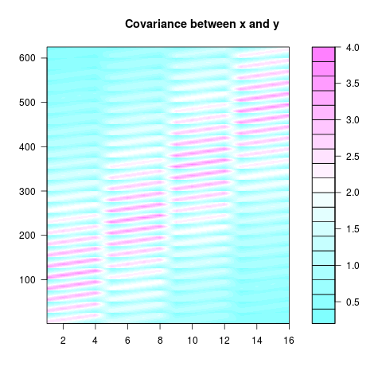
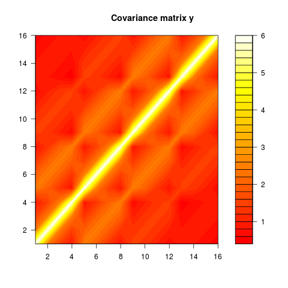
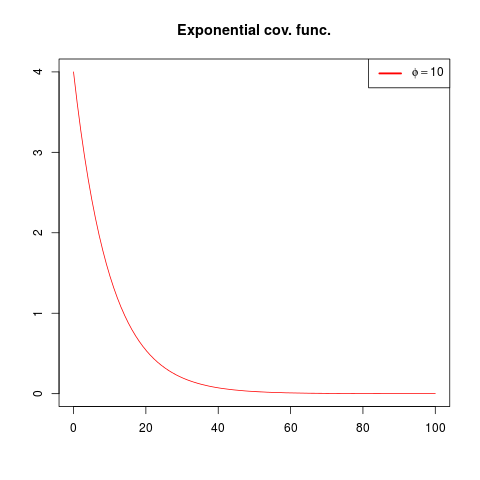

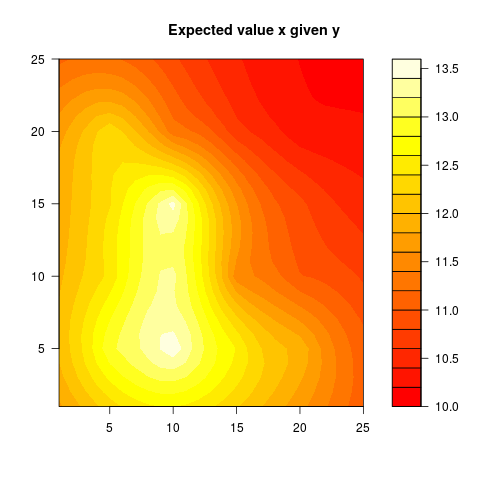
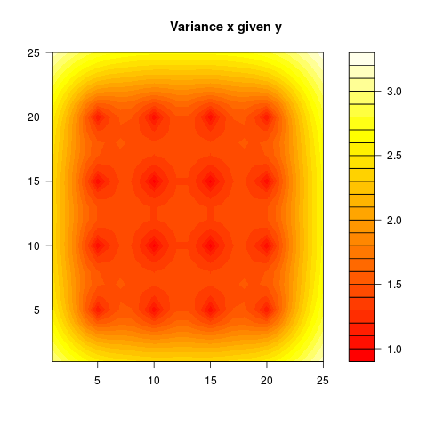

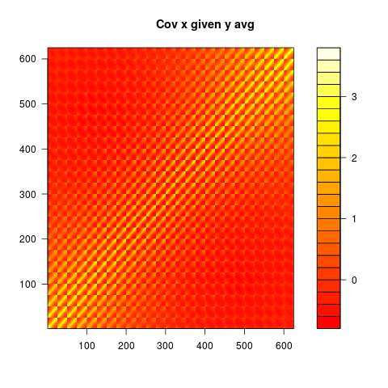
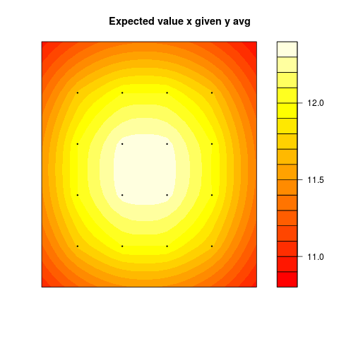
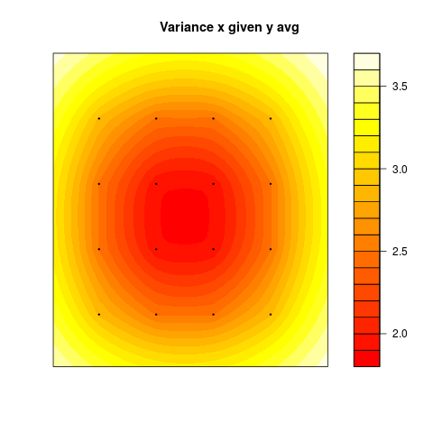
